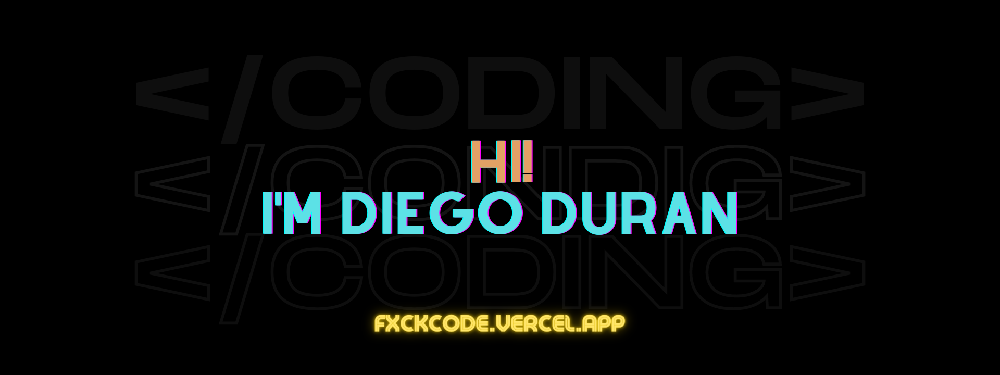
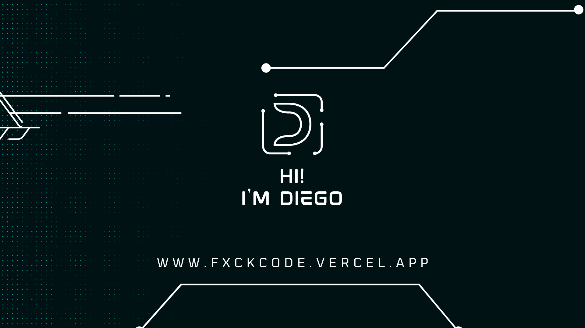
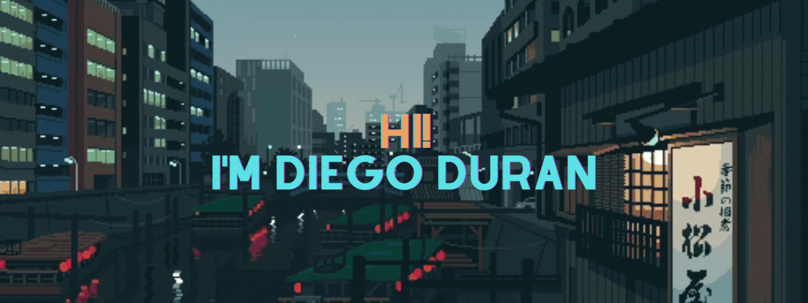

<p align="center">
  
</p>

<h1 align="center">
  
  <br>
  fxckcode
</h1>

<p align="center">
  <b>building conversational AI</b>
</p>

<p align="center">
  
  
  
  
  
  
</p>

<p align="center">
  <a href="https://github.com/fxckcode">github</a> ·
  <a href="https://linkedin.com/in/fxckcode">linkedin</a>
</p>

<br>



<br>
<br>

```text
🧠   currently building    → Mony — conversational AI for WhatsApp & Telegram
⚡   daily driver          → TypeScript, Python, Go
🎯   focused on            → making AI feel human
🛠️   tools                 → Next.js, Node, GraphQL, Hermes Agent
```

<br>

<p align="center">
  
</p>

---

<p align="center">
  <sub>quiet by nature · minimal by design</sub>
</p>
